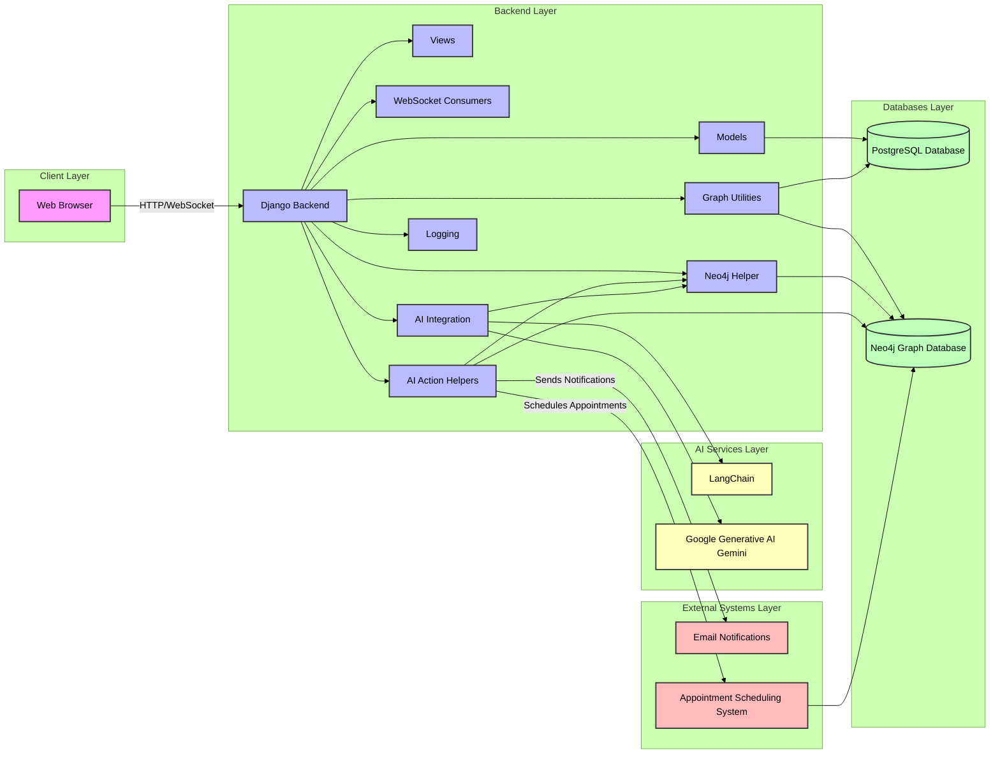

# Patient Chatbot

<p align="center">
  
</p>

## Table of Contents

- [Patient Chatbot](#patient-chatbot)
  - [Table of Contents](#table-of-contents)
  - [Overview](#overview)
  - [Features](#features)
  - [Architecture](#architecture)
  - [Components](#components)
    - [1. Models (`models.py`)](#1-models-modelspy)
    - [2. Graph Utilities (`graph_utils.py`)](#2-graph-utilities-graph_utilspy)
    - [3. WebSocket Consumer (`consumers.py`)](#3-websocket-consumer-consumerspy)
    - [4. AI Integration (`ai.py`)](#4-ai-integration-aipy)
    - [5. AI Action Helpers (`ai_action_helpers.py`)](#5-ai-action-helpers-ai_action_helperspy)
    - [6. Neo4j Helper (`neo4j_helper.py`)](#6-neo4j-helper-neo4j_helperpy)
  - [Technology Stack](#technology-stack)
  - [Setup Guide](#setup-guide)
    - [Prerequisites](#prerequisites)
    - [Clone the Repository](#clone-the-repository)
    - [Create a Virtual Environment](#create-a-virtual-environment)
    - [Install Dependencies](#install-dependencies)
    - [Configure Environment Variables](#configure-environment-variables)
    - [Set Up Databases](#set-up-databases)
      - [1. PostgreSQL](#1-postgresql)
      - [2. Neo4j](#2-neo4j)
    - [Populate Sample Data](#populate-sample-data)
    - [Run the Development Server](#run-the-development-server)
    - [Access the Chat Interface](#access-the-chat-interface)
  - [Usage](#usage)
  - [Contributing](#contributing)
  - [License](#license)

## Overview

The **Patient Assistant Chatbot** is an intelligent conversational agent designed to assist patients by providing timely information about their medical appointments, medications, and other health-related inquiries. Leveraging the power of Django, Neo4j, WebSockets, and advanced AI models, this chatbot offers a seamless and secure way for patients to interact with their healthcare data.

## Features

- **Real-time Communication:** Utilizes WebSockets for instant message exchange between patients and the chatbot.
- **Secure Data Handling:** Integrates Django's robust security features with Neo4j's graph database to manage sensitive patient information.
- **Intent Recognition:** Employs AI-driven intent classification to understand and respond to diverse patient queries.
- **Predefined Query Execution:** Executes parameterized Cypher queries against Neo4j to fetch relevant data securely.
- **Action Handling:** Supports actions like scheduling appointments and updating medication regimes with appropriate approvals and notifications.
- **Conversation Management:** Maintains and summarizes conversation history to provide context-aware responses.

## Architecture

The project is built using a modular architecture that integrates various components to deliver a cohesive chatbot experience. Here's an overview of the system's architecture:



1. **Django Backend:**
   - **Models:** Defines the `Patient` model to store patient information in the SQL database.
   - **Views:** Handles HTTP requests and renders templates.
   - **WebSocket Consumers:** Manages real-time communication between the client and the server using Django Channels.

2. **Neo4j Graph Database:**
   - Stores interconnected patient data, enabling efficient querying and relationship mapping.

3. **AI Integration:**
   - Utilizes LangChain and Google Generative AI models to process and generate intelligent responses based on patient data and intents.

4. **Web Frontend:**
   - Provides a user interface (`chat.html`) for patients to interact with the chatbot.

## Components

### 1. Models (`models.py`)

Defines the `Patient` model with relevant fields and establishes signals to populate graph data in Neo4j upon saving a patient instance.

### 2. Graph Utilities (`graph_utils.py`)

Handles the synchronization of patient data from the SQL database to the Neo4j graph database, ensuring that all relevant nodes and relationships are accurately represented.

### 3. WebSocket Consumer (`consumers.py`)

Manages real-time communication between the client and the server, handling incoming messages, generating AI responses, and sending them back to the client.

### 4. AI Integration (`ai.py`)

Handles the AI logic, including intent classification, executing Cypher queries against Neo4j, and generating comprehensive responses based on both SQL and graph data.

### 5. AI Action Helpers (`ai_action_helpers.py`)

Contains helper functions to handle specific actions like scheduling appointments and updating medication regimes, ensuring that these actions are processed securely and appropriately.

### 6. Neo4j Helper (`neo4j_helper.py`)

Provides helper functions to interact with the Neo4j database, executing Cypher queries securely.

## Technology Stack

- **Backend:**
  - [Django](https://www.djangoproject.com/): High-level Python web framework.
  - [Django Channels](https://channels.readthedocs.io/en/stable/): Adds WebSocket support to Django.
  
- **Databases:**
  - [PostgreSQL](https://www.postgresql.org/): Relational database for storing patient data.
  - [Neo4j](https://neo4j.com/): Graph database for managing interconnected patient information.
  
- **AI & NLP:**
  - [LangChain](https://langchain.com/): Framework for developing applications powered by language models.
  - [Google Generative AI (Gemini)](https://ai.google.dev): AI model for natural language understanding and generation.
  
- **WebSockets:**
  - [Channels](https://channels.readthedocs.io/en/stable/): Enables real-time communication in Django.
  
- **Other Tools:**
  - [Asgiref](https://asgi.readthedocs.io/en/latest/): Provides ASGI utilities.
  - [Logging](https://docs.python.org/3/library/logging.html): For logging information and errors.

## Setup Guide

Follow the steps below to set up the **Patient Chatbot** on your local machine.

### Prerequisites

Ensure you have the following installed on your system:

- **Python 3.8+**
- **PostgreSQL** (or your preferred SQL database)
- **Neo4j** (Community Edition is sufficient for development)
- **Git**

### Clone the Repository

```bash
git clone https://github.com/SiddanthEmani/patient_chatbot.git
cd patient-chatbot
```

### Create a Virtual Environment

It's recommended to use a virtual environment to manage dependencies.

```bash
python3 -m venv venv
source venv/bin/activate  # On Windows: venv\Scripts\activate
```

### Install Dependencies

```bash
pip install --upgrade pip
pip install -r requirements.txt
```

### Configure Environment Variables

Create a `.env` file in the root directory and add the following environment variables:

```env
# Django secret key for cryptographic signing
SECRET_KEY='your-django-secret-key'

# Security setting: Set to False in production for security reasons
DEBUG=False

# List of allowed hostnames that can serve the application
ALLOWED_HOSTS=localhost,127.0.0.1

# Database engine for PostgreSQL
POSTGRES_DB_ENGINE='django.db.backends.postgresql'

# Name of the PostgreSQL database
POSTGRES_DB='patient_chat_db'

# Username for the PostgreSQL database
POSTGRES_USER='chatuser'

# Password for the PostgreSQL database
POSTGRES_PASSWORD='chatpassword'

# Hostname for the PostgreSQL database
POSTGRES_HOST='localhost'

# Port number for the PostgreSQL database (default is 5432)
POSTGRES_PORT='5432' #DEFAULT PORT FOR POSTGRESQL

# API key for Gemini service
GEMINI_API_KEY='your-gemini-api-key'

# URI for connecting to the Neo4j database
NEO4J_URI='bolt://localhost:7687'

# Username for the Neo4j database
NEO4J_USER='neo4j_admin'

# Password for the Neo4j database
NEO4J_PASSWORD='neo4jpassword'
```

*Replace the placeholders with your actual credentials.*

### Set Up Databases

#### 1. PostgreSQL

- **Create a Database:**

```bash
psql -U postgres
CREATE DATABASE patient_chat_db;
CREATE USER yourusername WITH PASSWORD 'yourpassword';
GRANT ALL PRIVILEGES ON DATABASE patient_db TO yourusername;
ALTER USER yourusername WITH SUPERUSER;
\q
```

- **Apply Migrations:**

```bash
python manage.py migrate
```

#### 2. Neo4j

- **Install Neo4j:**

Refer to the [official Neo4j installation guide](https://neo4j.com/docs/operations-manual/current/installation/) for your operating system.

- **Start Neo4j:**

Ensure Neo4j is running on your machine with the credentials specified in your `.env` file.

- **Create Initial Data (Optional):**

You can use the Django admin or scripts to create `Patient` instances, which will automatically populate the Neo4j graph via signals.

### Populate Sample Data

- **Create a Superuser:**

```bash
python manage.py createsuperuser
```

- **Access Django Admin:**

Navigate to `http://localhost:{port}/admin/` and log in with your superuser credentials.

- **Add Patients:**

Add patient entries with all required fields. Upon saving, the `post_save` signal will populate the corresponding data in Neo4j.

### Run the Development Server

```bash
python manage.py runserver
```

Ensure that the development server starts without errors.

### Access the Chat Interface

Navigate to `http://localhost:{port}/` to access the chatbot interface. You should see the chat interface populated with the first patient’s data.

## Usage

1. **Open the Chat Interface:**

   Navigate to `http://localhost:{port}/` in your web browser.

2. **Interact with the Chatbot:**

   - **Send Messages:** Type your queries such as *"When is my next appointment?"* or *"What medications am I taking?"*
   - **Receive Responses:** The chatbot will respond with relevant information based on your query.

3. **Handle Actions:**

   - **Schedule Appointments:** Request to schedule new appointments.
   - **Update Medications:** Modify your current medication regime.

4. **Conversation History:**

   The chatbot maintains a conversation history to provide context-aware responses. If the history becomes too long, it will summarize previous interactions.

## Contributing

Contributions are welcome! Follow the steps below to contribute to the project:

1. **Fork the Repository**

2. **Create a Feature Branch**

```bash
git checkout -b feature/your-feature-name
```

3. **Commit Your Changes**

```bash
git commit -m "Add some feature"
```

4. **Push to the Branch**

```bash
git push origin feature/your-feature-name
```

5. **Open a Pull Request**

Provide a clear description of your changes and the problem they solve.

## License

This project is licensed under the [MIT License](LICENSE).

---

**Feel free to reach out if you have any questions or need further assistance!**
